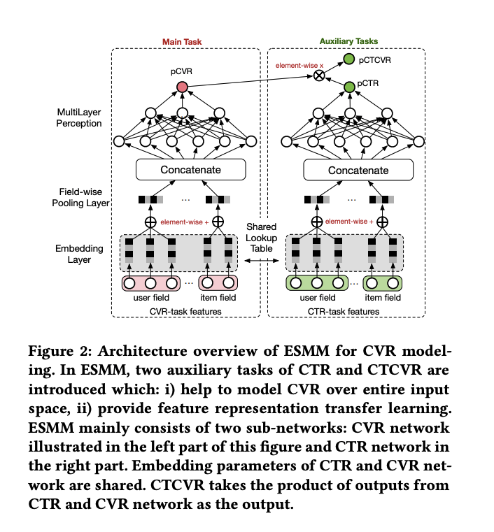
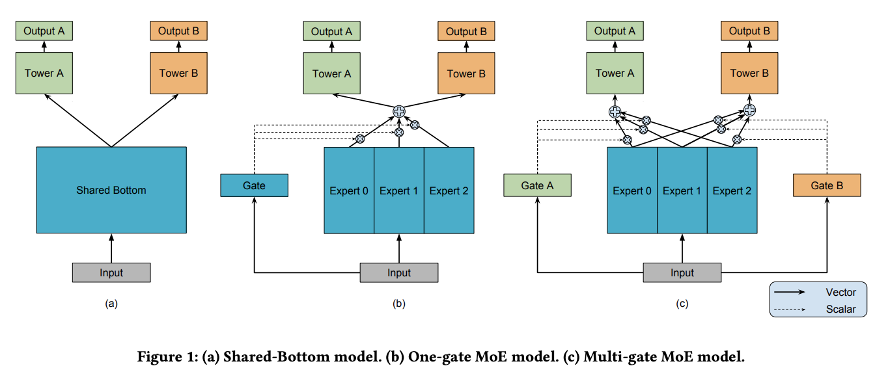

# 多任务模型
## 多任务的优势
* 相较于单任务，多任务不容易过拟合，因为多任务的损失函数同时受到多个任务的loss约束，这样会制约单个任务的性能；
* 多任务训练更加优雅，对资源的消耗更少，试想如果我们多任务有3个，变成独立的3个单任务进行训练的话会用数据集训练三个模型，这样会需要大量的资源进行三个模型的训练，资源利用率较低
* 缓解稀疏性，单个任务的数据一般存在严重的稀疏性即正负样本比率严重不平衡，导致的结果是单个任务的训练效果会比较差，利用多任务的共同训练机制及share bottom机制可以利用其他任务的训练数据对底层embedding进行修正，一定程度上会缓解稀疏性
* 修正样本偏差问题，由于单个任务的目的不一样，因此单任务选择的样本存在不一致的问题，例如：CTR任务选择的样本是曝光点击，CVR任务选择的样本是点击到购买，CVR任务的样本仅仅是CTR任务样本的一个子集，如果独立训练的话会造成单个模型训练结果的有偏，而多任务可以在一个样本空间进行训练，便于修正样本空间的问题。

## 多任务的一些问题
* 单个任务的性能容易受到限制，任务loss为多个任务loss的加权，对于单个任务的loss训练存在不充分的情况
* 任务之间存在蹊跷板现象及一个任务训练效果很好，另外一个很差或者没特别差别
* 多任务联合loss的方式无法断定出当前的loss为每个独立任务最好loss的加权

## ESMM模型

### 模型解读
模型主要有一个双塔的形式分别构建user和item相关的特征，然后进行embedding和拼接，最终输出到各个task的NN网络中进行学习，整体结构非常简单清晰，这里不一一细说。主要强调几个需要注意和可以优化的点：
* user filed和item filed侧的特征如何融合，图上写的比较模糊，这里我的理解为：分别对user的每个特征进行向量化，例如类别特征直接embedding为一个向量，序列特征需要进行融合成为一个embedding(具体融合可以自己定义实验，如：maxpool，avgpool，sum都可以尝试)，然后各个特征embedding在进行element-wise级别的加和操作，可以得到一个用户信息的整体embedding，item相关的信息处理类似，这里我们需要注意的是其中是没有考虑一些numeric特征的，如果有numeric特征我们需要在concatenate layer进行拼接上去
* 模型的训练的实际loss = loss_{ctr} + loss_{ctcvr}论文中加号右半部分写的是loss_{ctr}*loss_{cvr}这个容易让人搞混，因为实际上在整个样本空间上CVR是没有办法进行训练的，所以cvrloss根本计算不了，因为给定的输入数据是全样本空间即曝光数据，所以从曝光到点击的数据是CTR，从曝光到购买的数据是CTCVR这一点需要理解清楚；
* 可以尝试优化的点：1. 序列特征的处理技巧，attention等的加入；2. loss的加权方式需要根据实际训练结果调整，因为不同任务的正负样本不一致，因此每个任务的loss都不一样，如果两个loss数量级差距很大，较大的loss会主导loss的优化，导致数量级较小的那个loss训练不充分；

## MMOE模型

### 模型解读
模型跟ESMM大体框架基本一致，这里说一下主要的区别：其实图上说的也比较直观，大致就是传统的ESMM底层是直接共享一个share bottom的结构，这里一般是embedding层的共享，这种共享会让各个任务直接彼此受到很强的束缚，不能完全发挥单任务的最大价值；这里的改进是提出了一种expert机制，利用多个expert分别进行加权融合的形式去表达每个单任务，这样一定程度能缓解ESMM那找直接share bottom的束缚；
在深入一点就是，我们在得到融合后的input embedding(这里可以理解为user embedding和item embedding拼接后的整体embedding)，然后加入多个结构相同的DNN网络进行学习，虽然DNN网络结构相同，但是参数在初始化及反向传播迭代的时候会有一定的差别，相当于多个相同结构的DNN同时训练一批数据预测的结果，然后这里添加了一个门机制对各个DNN的输出进行加权处理得到最终的输出，最后塞入单个任务塔中得到最终的结果；
个人理解MMOE其实就是集成版本的ESMM但是这种内部模块的集成非不同模型的集成其效果有待验证，了解集成的应该都清楚，模型的差异化带来的集成效果较为明显但是模型相同参数不同的集成带来的效果一般都很小。

## 实验情况
###数据说明
选用的是uci的数据集https://archive.ics.uci.edu/ml/datasets/census+income

### 特征处理
数值特征进行归一化，类别特征进行embedding操作，由于没有区分user和item的特征，这里直接取前面7个特征为user特征后面的特征为item特征，然后进行向量化拼接
预测值分别为**income_50k**和**marital_status**

### 实验结果
|  模型  | auc_income  | auc_marital  |
|  ----  | ----  | ----  |
| ESMM  | 90.2% | 96.2%  |
| MMOE  | 89.6% | 96.1%  |
可以看到在这个小数据集上ESMM效果于MMOE差别很小，较大数据集还未实验